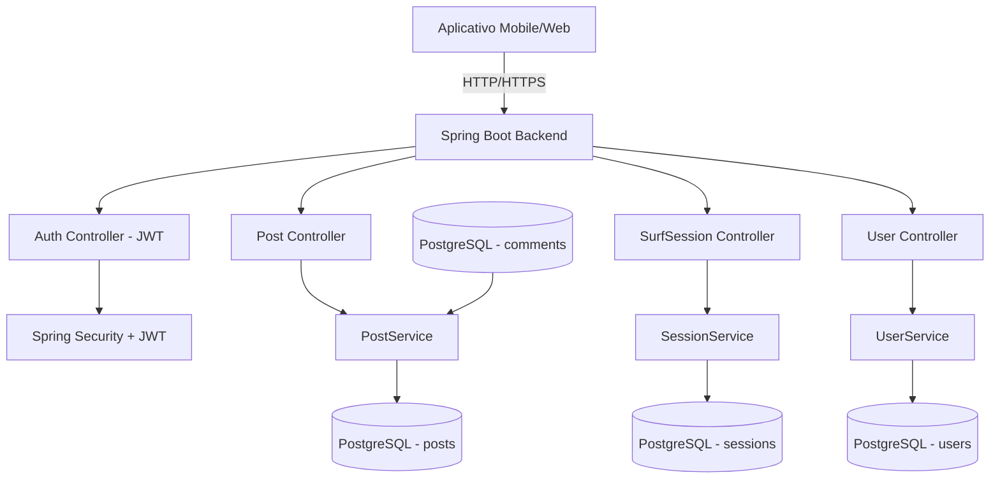
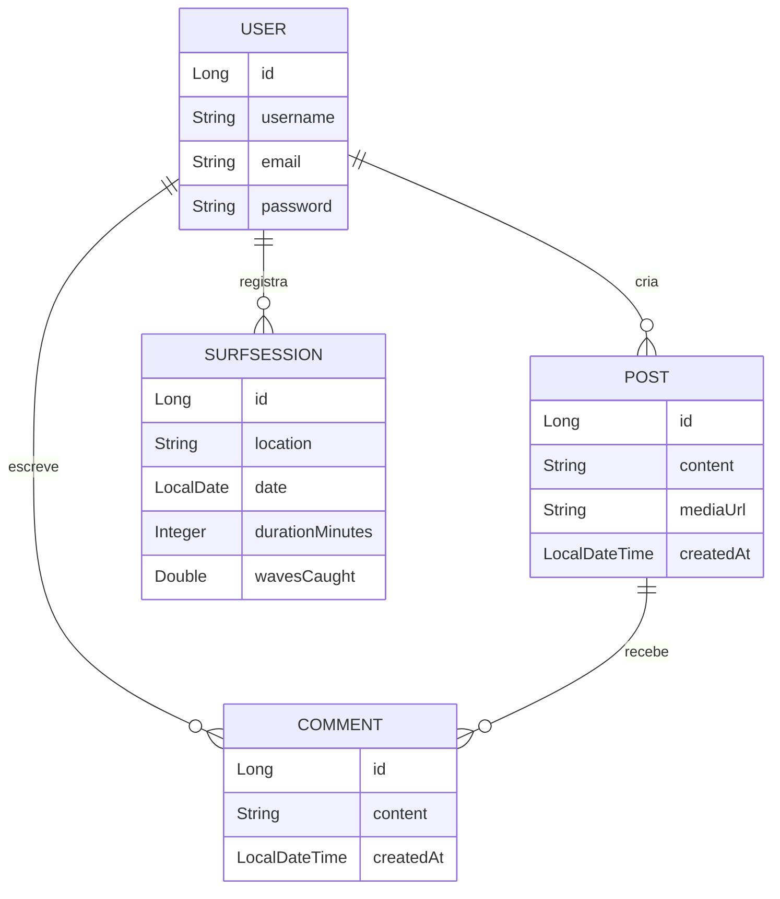
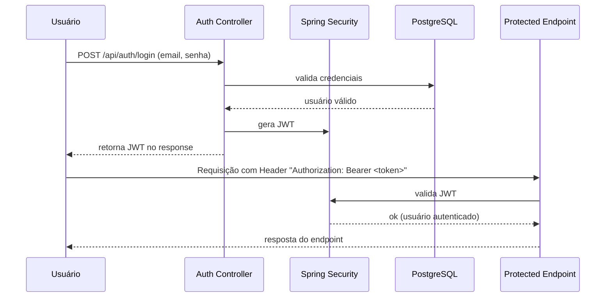

Perfeito, Guilherme 👌
Aqui está o **README.md final completo** do **Soul Surf Backend** já com **arquitetura**, **MER** e **fluxo JWT**, pronto para você colocar no repositório:

```markdown
# 🌊 Soul Surf - Backend

O **Soul Surf** é uma aplicação que une a ideia de comunidade do **Reddit** com o tracking esportivo do **Strava**, mas totalmente voltado para **surfistas**.  
Este repositório contém o **backend em Spring Boot**, responsável por autenticação, gerenciamento de usuários, posts, comentários e sessões de surf.

---

## 🚀 Tecnologias Utilizadas

- **Java 17+**
- **Spring Boot 3.3.x**
  - Spring Web
  - Spring Data JPA
  - Spring Security + JWT
  - Lombok
- **PostgreSQL** (banco principal)
- **H2 Database** (para testes locais)
- **Maven** (gerenciamento de dependências)
- **Docker & Docker Compose** (infraestrutura local)

---

## 📂 Estrutura do Projeto

```

src/main/java/com/soulsurf
│
├── SoulSurfApplication.java   # Classe principal
│
├── config/                    # Configurações globais (CORS, segurança, etc.)
├── controller/                # Controllers REST (endpoints públicos e privados)
├── dto/                       # Objetos de transferência (entrada/saída)
├── entity/                    # Entidades JPA (User, Post, Comment, SurfSession)
├── repository/                # Interfaces de acesso ao banco (Spring Data JPA)
├── security/                  # JWT, filtros e configuração de autenticação
└── service/                   # Regras de negócio

````

---

## 🛠️ Configuração e Execução

### 1. Clonar o repositório
```bash
git clone https://github.com/seu-usuario/soul-surf-backend.git
cd soul-surf-backend
````

### 2. Configurar o banco de dados

Crie um banco no PostgreSQL:

```sql
CREATE DATABASE soulsurf;
```

Crie um usuário (se necessário):

```sql
CREATE USER soulsurf_user WITH PASSWORD 'soulsurf_pass';
GRANT ALL PRIVILEGES ON DATABASE soulsurf TO soulsurf_user;
```

### 3. Arquivo `application.yml`

```yaml
spring:
  datasource:
    url: jdbc:postgresql://localhost:5432/soulsurf
    username: soulsurf_user
    password: soulsurf_pass
  jpa:
    hibernate:
      ddl-auto: update
    show-sql: true
    properties:
      hibernate:
        format_sql: true
  security:
    jwt:
      secret: changeme123
      expiration: 86400000 # 1 dia
```

### 4. Rodar com Maven

```bash
./mvnw spring-boot:run
```

### 5. Rodar com Docker Compose

`docker-compose.yml`:

```yaml
version: '3.8'
services:
  postgres:
    image: postgres:15
    container_name: soulsurf_postgres
    environment:
      POSTGRES_USER: soulsurf_user
      POSTGRES_PASSWORD: soulsurf_pass
      POSTGRES_DB: soulsurf
    ports:
      - "5432:5432"
    volumes:
      - postgres_data:/var/lib/postgresql/data

volumes:
  postgres_data:
```

Inicie:

```bash
docker-compose up -d
```

---

## 🔑 Autenticação JWT

### Registro

```http
POST /api/auth/register
Content-Type: application/json

{
  "username": "surfista123",
  "email": "surfista@mail.com",
  "password": "123456"
}
```

### Login

```http
POST /api/auth/login
Content-Type: application/json

{
  "email": "surfista@mail.com",
  "password": "123456"
}
```

Resposta:

```json
{
  "token": "eyJhbGciOiJIUzI1NiIsInR5cCI6..."
}
```

Use o token nos endpoints privados:

```
Authorization: Bearer <token>
```

---

## 📌 Endpoints Principais (MVP)

### Usuários

* `POST /api/auth/register` → registrar usuário
* `POST /api/auth/login` → autenticar usuário
* `GET /api/users/me` → dados do usuário logado

### Posts & Comentários

* `POST /api/posts` → criar post
* `GET /api/posts` → listar posts
* `POST /api/posts/{id}/comments` → comentar em um post

### Sessões de Surf

* `POST /api/sessions` → registrar sessão (data, local, duração)
* `GET /api/sessions` → listar sessões do usuário
* `GET /api/sessions/{id}` → detalhes de uma sessão

---

## 🏗️ Arquitetura do Sistema



---

## 📊 Modelo Entidade-Relacionamento (MER)



---

## 🔑 Fluxo de Autenticação JWT

O sistema utiliza **JWT (JSON Web Token)** para autenticação. O fluxo funciona assim:



### Resumo do processo:

1. O usuário faz login (`/api/auth/login`) com **email + senha**.
2. O backend valida as credenciais no banco.
3. Se estiver correto, gera um **JWT assinado** e retorna ao usuário.
4. O usuário utiliza o token no header `Authorization: Bearer <token>` para acessar endpoints privados.
5. O **Spring Security** valida o token em cada requisição antes de liberar o acesso.

---

## 📊 Roadmap

* [x] Estrutura inicial (User, Post, Comment, Session)
* [x] Autenticação JWT
* [ ] Upload de mídia (imagens/vídeos dos posts)
* [ ] Ranking de surfistas
* [ ] Feed em tempo real (WebSocket)
* [ ] Integração com mapas e previsão do tempo
* [ ] Deploy em ambiente cloud (Azure App Service, AWS, Render ou Kubernetes)

---

🌊 **Soul Surf** – Conectando surfistas pelo mundo através da tecnologia!


